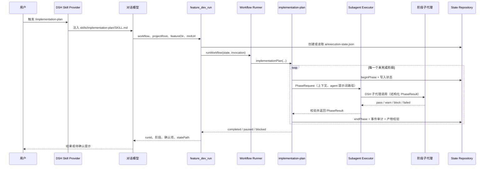

# Architecture

`dsh-feature-dev` 是一个运行在 DeepSeek Harness（DSH）中的 Cordis Bundle。它把需求交付拆成可恢复的工作流：Skill 负责把用户意图转换为工具调用，workflow 负责确定性编排，agent 负责完成单个阶段的工作。

## 分层

| 层 | 位置 | 职责 |
| --- | --- | --- |
| Bundle 入口 | `src/index.ts`、`cordis.patch.yml` | 注册 Skill provider 与 4 个 `feature_dev_*` 工具，提供默认配置。 |
| Skill | `skills/*/SKILL.md` | 面向模型的轻量使用说明：何时调用哪个工作流、传哪些参数、如何处理结果。 |
| Tool | `src/tools/` | 规范化调用参数、创建或读取状态、创建子代理执行器，并暴露 run / confirm / resume / status。 |
| Workflow | `src/workflows/` | 定义阶段次序、条件分支、门禁与产物要求。 |
| Runtime | `src/runtime/` | 状态机、持久化、门禁、路径保护、产物校验、生命周期与指标。 |
| Agent | `agents/*.md` | 每个阶段的角色指令、输入、产物和输出约定。 |
| Executor | `src/executors/` | 将阶段请求发送到 DSH 子代理，并将结构化或文本回复转换为 `PhaseResult`。 |

`lib/` 是由 TypeScript 编译出的发布产物；修改源码时应修改 `src/`、`skills/`、`agents/` 与文档，而不是直接编辑 `lib/`。

## 指令执行链路

以用户输入 `/implementation-plan <MRD URL> --feature-dir req/foo` 为例：



执行的控制权归 runtime，而不归 Skill 或子代理：

1. Skill 告诉模型调用 `feature_dev_run`，但不负责阶段编排。
2. `runFeatureDev` 在 `src/tools/run.ts` 中校验并规范化入参，创建 `StateRepository` 和 `SubagentExecutor`，再交给 `runWorkflow`。
3. workflow 调用 state machine 计算下一个合法阶段；`StateRepository` 在每次开始、结束、确认和恢复时原子写入状态与审计事件。
4. `SubagentExecutor` 读取 `agents/<agent>.md`，将中文输出策略、角色指令、阶段上下文和 JSON 输出合约发送给子代理。
5. 子代理只返回 `PhaseResult`；workflows/phase-driver 校验产物、决定是否 raise gate、阻塞或继续。

## 工作流

### implementation-plan

```text
INITIALIZED
  → MRD_READER        (mrd-reader)
  → SERVICE_ROUTER    (app-router)
  → [post_service_router 确认门]
  → BRANCH_GATE       (prepare service requirement branch)
  → CLARIFY           (main-conversation action; no subagent)
  → PRD               (prd-generator)
  → [pre_prd 确认门]
  → TECH_DESIGN       (tech-design)
  → [pre_tech_design 确认门]
  → COMPLETED
```

它生成 `mrd-original.md`、`mrd-clarified.md`、`prd.md` 和 `tech-design.md`。启动时 `featureDir` 是正式需求目录名的必填输入，URL 的抓取、MRD 解析和服务路由首先在 `.tmp/<featureDir 的目录名>` 中运行；既然已提供需求标识，不再使用 MRD URL hash，只有需求分支准备成功才沉淀到正式目录。若 app-router 无法从 MRD 确认可写服务，runtime 返回 `pendingMainAction.kind = route_services`，主会话收集并写入 `apps.json` 后恢复，不重新启动 app-router；这次用户输入即服务范围确认，随后直接进入分支门禁。MRD 澄清同样由主会话完成：runtime 返回 `pendingMainAction` 的输入/输出路径，主会话写入澄清文档后恢复，工作流只做本地校验并直接进入 PRD，不会启动澄清子代理。正常自动路由时，`post_service_router` 门仍在服务路由产出 `apps.json` 后触发。这里的 `pre_prd` 门是在 PRD 已写出后触发，用于进入技术设计前确认 PRD；`pre_tech_design` 门是在技术方案写出后触发，用于进入代码实现前确认方案。

### code-gen-tdd

```text
TEST_SPEC → 确认 → IMPLEMENTATION → REVIEW
  → TEST_GENERATION → TEST_EXECUTION → SUMMARY → COMPLETED
                    ↘ 修复后回到相应阶段（受 repair 上限约束）
```

该 workflow 管理实现与验证的恢复循环。审查或测试失败可走修复分支，超过 `maxRepairAttempts` 后阻塞。

### mrd-to-code

`mrd-to-code` 是根编排器，按 `implementation-plan → code-gen-tdd → archive` 顺序运行，并复用同一个运行状态和 `runId`。任一确认门、阻塞或中断都会立即将控制权交还给用户。

### 其他工作流

| 工作流 | 类型 | 主要 agent / 结果 |
| --- | --- | --- |
| `knowledge-base` | one-shot | `kb-update`；建立或更新知识库。 |
| `prd-clarify` | one-shot | `mrd-clarify`；仅做需求澄清。 |
| `influence-menu` | one-shot | `influence-menu`；输出只读影响面分析。 |
| `bugfix` | 分支工作流 | `bugfix-locate` 后按分类进入文档修订或代码修复，再验证和报告。 |
| `archive` | 线性工作流 | 快照、新鲜度检查、KB 更新、归档报告。 |

## 确认、恢复和失败

门禁由 `GateEngine` 创建，待确认项保存在状态文件。模型应向用户展示提示与选项；用户选择后调用 `feature_dev_confirm`：

- `accept` / `proceed`：清除门禁，等待显式恢复。
- `revise`：回退到创建该门禁的阶段，下一次恢复会重跑该阶段。
- `abort`：结束本次运行。

会话在用户完成非 `abort` 确认后应立即调用 `feature_dev_resume` 继续，不应要求用户再发一条 `/resume`。若状态包含 `pendingMainAction`，主会话应完成其中指定的文件操作，再使用工具最新返回的正式 `featureDir` 恢复。若普通阶段返回 `block` 或 `failed`，线性工作流会处于 `BLOCKED`，恢复时会重跑最近的失败阶段。运行状态位于 `<featureDir>/ai/execution-state.json`，同目录还有便于人工阅读的 `execution-state.md` 与审计日志。

## 关键约束

- 子代理预算在整个 run 内累计，默认最大值为 24（`maxTotalAgents`）。
- 生产环境通过 DSH 的 `ctx.subagents` 启动真实子代理；测试和离线夹具使用 null port。
- 子代理的输出必须符合 `PhaseResult` 合约。无效 JSON、错误状态或缺少被要求的产物都会使阶段失败或阻塞。
- `strictGates` 默认开启，阻塞确认不能被 `resume` 绕过。

有关可用命令与示例，请阅读 [QUICK_START.md](QUICK_START.md)。
