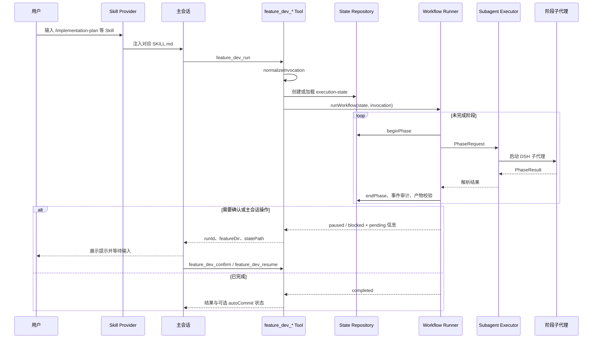

# Architecture

`dsh-feature-dev` 是运行在 DeepSeek Harness（DSH）中的 Cordis Bundle。它把需求交付分为三层：Skill 说明何时调用、Tool 处理输入和运行边界、Workflow 按持久化状态机驱动阶段与子代理。

## 边界与原则

- Bundle 负责工作流编排、状态、门禁、产物校验、子代理派发和可选指标上报；业务代码只在用户指定的业务仓库内修改。
- Skill 不直接执行或决定阶段跳转；子代理不直接修改运行状态。状态机和 `StateRepository` 是唯一的流程权威。
- 所有用户输入在 `normalizeInvocation` 后成为 `FeatureDevInvocation`；后续层不再解析原始命令字符串。
- 每个子代理只返回 `PhaseResult`。流程层负责验证产物、决定是否暂停、修复、继续或阻塞。

## 模块划分

| 模块 | 位置 | 职责 |
| --- | --- | --- |
| Bundle 入口 | `src/index.ts`、`cordis.patch.yml` | 注册一个 Skill provider、四个 `feature_dev_*` 工具和中文输出策略；解析默认配置。 |
| Skill | `skills/*/SKILL.md` | 提供 8 个可发现工作流的使用约定。 |
| Tool | `src/tools/` | 提供 `feature_dev_run`、`feature_dev_confirm`、`feature_dev_resume`、`feature_dev_status`。 |
| Workflow | `src/workflows/` | 定义多阶段工作流、one-shot 工作流、分支准备、阶段驱动与产物要求。 |
| Runtime | `src/runtime/` | 处理调用规范化、路径保护、状态机、门禁、状态持久化、产物校验与 Git 自动提交。 |
| Executor | `src/executors/` | 将 `PhaseRequest` 交给 DSH 子代理，并解析结构化或文本形式的 `PhaseResult`。 |
| Agent 与规则 | `agents/`、`rules/`、`templates/` | 阶段提示词、按需规则及文档模板。 |
| Metrics | `src/metrics/` | 可选地记录 `code-gen-tdd` 与 `bugfix` 的运行指标。 |

`lib/` 是 TypeScript 编译产物；源码变更应落在 `src/`、`skills/`、`agents/`、`rules/`、`templates/` 或文档中，而不是直接编辑 `lib/`。

## 执行链路



生产环境使用 `ctx.subagents` 创建真实子代理。测试或离线夹具没有 DSH 上下文时，Tool 层改用 null port，使状态机和产物校验可独立测试。

## 核心合约与持久化

| 合约 | 位置 | 用途 |
| --- | --- | --- |
| `FeatureDevInvocation` | `src/types/contracts.ts`、`schemas/invocation.schema.json` | 已规范化的工作流输入、路径、选项和模型覆盖。 |
| `PhaseRequest` | `src/types/contracts.ts` | 工作流交给子代理的阶段、输入、提示词路径和产物要求。 |
| `PhaseResult` | `src/types/contracts.ts`、`schemas/phase-result.schema.json` | 子代理完成、警告、阻塞或失败的结构化结果。 |
| `ExecutionState` | `src/types/contracts.ts`、`schemas/execution-state.schema.json` | 运行状态、阶段历史、确认门、主会话操作和恢复上下文。 |

状态目录为：

```text
<featureDir>/ai/current-run.json
<featureDir>/ai/runs/<runId>/execution-state.json
<featureDir>/ai/runs/<runId>/execution-state.md
<featureDir>/ai/runs/<runId>/run-events.jsonl
```

`execution-state.json` 是恢复依据，`execution-state.md` 是可读投影，`run-events.jsonl` 是追加式审计记录。写入使用临时文件再重命名；旧版平铺状态会在首次读取时迁移到 `runs/<runId>/`。

## 工作流

| 工作流 | 实际阶段与分支 | 关键行为 |
| --- | --- | --- |
| `implementation-plan` | `MRD_READER → SERVICE_ROUTER → BRANCH_GATE → CLARIFY → PRD → TECH_DESIGN` | 需求先在 `.tmp/<需求名>` 暂存；分支准备后将正式文档和状态落到主服务仓库。`CLARIFY` 是主会话操作，不启动澄清子代理。 |
| `code-gen-tdd` | 对选中的每个可写服务执行：测试规格 → 实现 → 审查 → 可选测试生成/执行 → 汇总；失败时进入修复分支 | 不传 `featureId` 时从 `apps.json` 解析全部主改和协作服务；传 `featureId` 时由 `feature-map.json` 限定服务范围。默认跳过测试生成与执行；只有 `--skip-unit-tests=false` 才启用。修复次数受 `maxRepairAttempts` 限制。 |
| `bugfix` | `LOCATE → (DOC_REVISION?) → CODE_FIX → (VERIFY?) → REPORT` | `LOCATE` 成功后自动按分类选择分支；只有业务需求缺口会进入 `DOC_REVISION`。验证仅在请求单元测试时运行。 |
| `archive` | `SNAPSHOT → FRESHNESS_CHECK → KB_UPDATE → REPORT` | 创建归档报告并检查、更新知识库。 |
| `mrd-to-code` | `implementation-plan → code-gen-tdd → archive` | 一个 `runId` 和一份根状态贯穿三个子工作流；任一暂停或阻塞立即返回主会话。 |
| `knowledge-base`、`prd-clarify`、`influence-menu` | 单次子代理调用 | 通过 `oneShot` 执行并按声明校验必要产物。 |

`implementation-plan` 的服务路由有两个主会话分支：服务范围不完整时返回 `pendingMainAction.kind = route_services`，主会话补全 `apps.json` 后恢复；需求澄清时返回 `clarify_mrd`，主会话写入 `mrd-clarified.md` 后恢复。两者都不会重新启动已完成的路由或澄清阶段。技术方案必须输出“功能点 × 服务”矩阵及等价的 `feature-map.json`，PRD、技术方案和映射文件成功生成后会同步到所有协作服务的需求目录。

## 门禁、恢复与失败

门禁由 `GateEngine` 创建并写入 `pendingConfirmations`。当前工作流实际使用的阻塞门包括：

- `post_service_router`：确认 `apps.json` 的可写服务范围后再准备需求分支。
- `pre_prd`：PRD 生成后，确认其作为技术方案依据。
- `pre_tech_design`：技术方案生成后，确认进入代码实现。
- `post_test_spec`：测试规格生成后，确认继续 TDD 实施。

`feature_dev_confirm` 只处理用户选择。`accept` / `proceed` 清除门禁，`revise` 回退到创建该门的阶段，`abort` 结束运行。只有 `post_test_spec` 的 `accept` / `proceed` 会立即自动恢复；其他非终止选择之后，调用方使用最新的 `projectRoot`、`featureDir` 与 `runId` 调用 `feature_dev_resume`。

`resume` 拒绝绕过未处理的确认门。阻塞运行在恢复前会回退最近失败阶段；已完成、已中止或失败的终态不能恢复，必须新建运行。

## Git 行为

`implementation-plan` 的 `BRANCH_GATE` 会读取 `apps.json` 的 `primary`、`collaborators` 与 `repositories`，为每个可写服务切换或创建 `fun_<版本>_<需求编号>_<标题>_<Git 用户名>` 分支。新分支从 `origin/release` 创建并以 `git push -u origin <branch>` 发布。

`implementation-plan`、`code-gen-tdd` 和 `bugfix` 可传 `--auto-comit`（兼容 `--auto-commit`）。运行成功结束时，`src/runtime/auto-commit.ts` 执行 `git add --all`、`git commit` 与 `git push`；多服务的 planning/TDD 会逐个可写服务仓库执行。它会包含新增、删除及其他现有工作区变更；逐服务结果通过 `autoCommit.services` 返回。

## 配置与指标

`cordis.patch.yml` 提供默认值，`resolveConfig` 负责合并覆盖：

| 配置 | 默认值 |
| --- | --- |
| `defaultWorkflow` | `code-gen-tdd` |
| `subagentProvider` | `spawn` |
| `strictGates` | `true` |
| `maxTotalAgents` | `24` |
| `maxRepairAttempts` | `3` |
| `metrics.enabled` | `true` |
| `metrics.workflows` | `code-gen-tdd`、`bugfix` |

模型路由可按 `planning`、`coding`、`review`、`summary` 覆盖；未设置角色时由 DSH 父会话继承模型配置。指标上报仅挂接到 `code-gen-tdd` 与 `bugfix`，并由 Lifecycle 在完成时发送。

## 发布内容

发布包包含 `lib/` 以及 `skills/`、`agents/`、`rules/`、`templates/`、`scripts/`、`schemas/`、`CHANGELOG.md` 和 `cordis.patch.yml`。`docs/` 不在 `package.json#files` 中，因此文档更新不会进入 npm 包，但会随 Git 仓库分发。

使用方式见 [QUICK_START.md](QUICK_START.md)，开发与发布步骤见 [DEVELOPMENT.md](DEVELOPMENT.md)。
