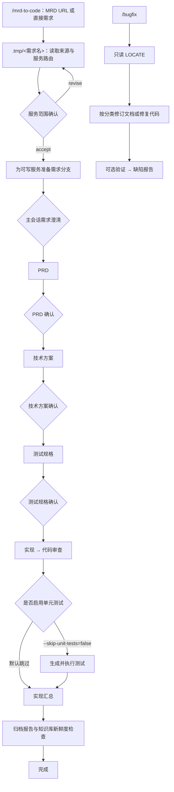

# Quick Start

本指南以当前 `dsh-feature-dev` 0.1.5 的 Skill、工具和状态机实现为准。它是面向业务 Git 仓库的 DSH 工作流 Bundle，不是业务项目本身。

## 前置条件

- Node.js 22 或更高版本，以及可用的 DeepSeek Harness（DSH）。
- 在目标业务项目的 Git 仓库根目录启动 DSH 会话；默认 `projectRoot` 使用该会话的工作目录。
- 如果显式传 `--project-root`，必须传绝对路径。
- `/implementation-plan` 和 `/mrd-to-code` 必须提供正式需求目录名：`req/{版本号}_{需求编号}_{中文需求标题}`，例如 `req/2.0.0_103111_fastjson替换为jackson`。不要预先手工创建该正式目录。
- 需求规划会为可写服务准备需求分支。每个目标仓库需要有有效的 `git config user.name`、`origin/release` 和干净工作区；新分支会从 `origin/release` 创建并推送到 `origin`。

## 安装插件（默认：GitLab `git+URL`）

默认按 [PUBLISH.md](PUBLISH.md) 的 GitLab 安装方式使用已发布版本。Git 依赖首次安装前，需要为目标 DSH profile 批准 `prepare` 构建脚本；以下以 `web` profile 为例：

```powershell
dsh plugin --profile web install
$workspace = Join-Path $env:USERPROFILE '.dsh\profiles\web\pnpm-workspace.yaml'
notepad $workspace
```

在打开的 `pnpm-workspace.yaml` 的 `allowBuilds:` 下加入以下条目，并保留文件既有内容：

```yaml
allowBuilds:
  '@engios/dsh-feature-dev': true
```

然后安装指定版本（推荐，便于回归和回滚）：

```powershell
dsh plugin --profile web add git+http://gitlab.iheatingos.com:8083/engios/dsh-feature-dev.git#v<version>
dsh --profile web --dump-config
```

如需跟随远端默认分支，可省略 `#v<version>`。DSH 会执行 `git clone`、`pnpm install` 和已批准的 `prepare`，编译出 `lib/` 后再加载 Bundle。

本地路径安装仅用于开发验证：

```powershell
cd D:\ai\dsh-feature-dev
pnpm build
pnpm test:package
dsh plugin --profile web add D:\ai\dsh-feature-dev
```

开发修改后重新执行 `pnpm build`，再按 DSH 的插件管理流程刷新或重新安装。本地验证、私有仓库认证和其他分发方式见 [PUBLISH.md](PUBLISH.md)。

## 可用 Skill

```text
/mrd-to-code          端到端：需求规划 → TDD 实现 → 归档
/knowledge-base       建立或刷新 app-knowledge-base
/implementation-plan  从 MRD 或直接需求生成 PRD 与技术方案
/code-gen-tdd         按技术方案实施、审查和可选测试
/bugfix               定位并最小化修复已有需求中的缺陷
/archive              归档已完成的需求
/prd-clarify          对已有 mrd-original.md 做独立澄清
/influence-menu       只读分析符号、文件或字段的影响面
```

## 端到端流程



`/implementation-plan` 只执行图中的规划部分，完成后再单独执行 `/code-gen-tdd`。`/archive` 也可以对已经实现的需求单独运行。

多服务需求中，规划阶段会将 `prd.md`、`tech-design.md` 与 `feature-map.json` 同步到每个协作服务的 `req/<需求名>/`。技术方案必须包含“功能点 × 服务”矩阵；`feature-map.json` 是其可机器读取版本。随后 `/code-gen-tdd` 读取 `apps.json`，对每个主改和协作服务分别执行测试规格、实现、审查和可选测试阶段。

使用 `--feature-id F-001` 时，`code-gen-tdd` 只执行 `feature-map.json` 中 F-001 所属的服务，并把测试规格、审查和测试报告写入 `ai/F-001/`；不传该参数则保持全需求、全服务执行。

### 多服务目录定位

相对 `--feature-dir` 只相对 `projectRoot` 解析，不会在主服务和协作服务中自动搜索同名目录。规划启动时可使用相对目录；服务路由完成后，主服务目录成为状态和 `apps.json` 的入口，协作服务目录由 `apps.json.repositories` 自动定位。因此继续 TDD、确认或恢复时，必须使用工具返回的主服务**绝对** `featureDir`，不要继续使用聚合根下的相对路径。

例如 `projectRoot` 为 `D:\workspace`，`apps.json` 路由到 `D:\workspace\services\order`（主服务）和 `D:\workspace\services\payment`（协作服务）后，需求目录分别为：

```text
D:\workspace\services\order\req\2.0.0_103111_订单能力
D:\workspace\services\payment\req\2.0.0_103111_订单能力
```

后续按功能点执行时，以主服务目录作为入口：

```text
/code-gen-tdd --project-root D:\workspace --feature-dir D:\workspace\services\order\req\2.0.0_103111_订单能力 --feature-id F-001
```

## 最短路径：从需求到归档

使用 MRD：

```text
/mrd-to-code https://example.com/share_doc/?token=xxx --feature-dir req/2.0.0_103111_fastjson替换为jackson
```

直接输入需求：

```text
/mrd-to-code "用户可按订单编号查询物流状态，并查看最新节点" --feature-dir req/2.0.0_103112_物流状态查询
```

MRD URL 或直接需求会先落在 `<projectRoot>/.tmp/<需求目录名>` 中。该目录仅用于来源整理和服务路由；服务范围确认及分支准备完成后，运行状态和正式文档会迁移到主服务仓库中的 `req/<需求目录名>`。

## 分步执行

### 1. 可选：建立项目知识库

```text
/knowledge-base
```

知识库产物为 `<projectRoot>/app-knowledge-base/CONTEXT.md`。如需指定项目根目录，请使用绝对路径，例如：

```text
/knowledge-base --project-root D:\workspace\order-service
```

### 2. 生成 PRD 与技术方案

```text
/implementation-plan https://example.com/share_doc/?token=xxx --feature-dir req/2.0.0_103111_fastjson替换为jackson
/implementation-plan "用户可按订单编号查询物流状态，并查看最新节点" --feature-dir req/2.0.0_103112_物流状态查询 --clarify-mode=batch
```

`--clarify-mode` 可选值为 `dialogue`（默认，逐项澄清）和 `batch`（集中提出问题）。

### 3. 按技术方案生成代码

```text
/code-gen-tdd --feature-dir req/2.0.0_103111_fastjson替换为jackson
/code-gen-tdd --feature-dir req/2.0.0_103111_fastjson替换为jackson --feature-id F-001
/code-gen-tdd --feature-dir req/2.0.0_103111_fastjson替换为jackson --skip-unit-tests=false
```

默认跳过测试生成和执行；只有明确指定 `--skip-unit-tests=false` 才会运行测试阶段。

### 4. 修复缺陷

```text
/bugfix --feature-dir req/2.0.0_103111_fastjson替换为jackson bug描述：支付失败后订单状态没有回滚
```

Bugfix 先运行只读的 `LOCATE`，定位成功后会自动进入对应分支：代码缺陷直接修复，业务需求缺口先最小化修订既有需求文档。验证仅在显式启用单元测试时执行。

### 5. 独立澄清、归档或分析影响面

```text
/prd-clarify --feature-dir req/2.0.0_103111_fastjson替换为jackson --clarify-mode=batch
/archive --feature-dir req/2.0.0_103111_fastjson替换为jackson
/influence-menu OrderService.charge
/influence-menu src/service/OrderService.java:142
/influence-menu order.status
```

## `--auto-comit`：自动提交并推送

`implementation-plan`、`code-gen-tdd` 和 `bugfix` 支持 `--auto-comit`；`--auto-commit` 是等价的兼容拼写。该参数不支持 `/mrd-to-code`、`/archive` 或其他工作流。

```text
/implementation-plan <MRD URL> --feature-dir req/2.0.0_103111_fastjson替换为jackson --auto-comit
/code-gen-tdd --feature-dir req/2.0.0_103111_fastjson替换为jackson --auto-comit
/bugfix --feature-dir req/2.0.0_103111_fastjson替换为jackson bug描述：支付失败后订单状态没有回滚 --auto-comit
```

仅在工作流状态为 `completed` 时才执行。单服务需求会在 `featureDir` 所属 Git 仓库执行；多服务的 `implementation-plan` 与 `code-gen-tdd` 会对每个可写服务仓库分别执行：

```text
git add --all
git commit -m "feat(<workflow>): complete <runId>"
git push
```

因此会提交新增、修改和删除的文件，也会包含各目标仓库中其他尚未提交的工作区变更。使用前请确认工作区内容都应进入同一提交；没有改动时不会创建空提交。工具结果中的 `autoCommit.status` 会返回 `committed_and_pushed`、`no_changes`、`commit_failed` 或 `push_failed`，多服务明细位于 `autoCommit.services`。

## 确认门、主会话操作与恢复

工作流会在服务范围、PRD、技术方案和测试规格等节点暂停。应当查看工具返回的 `pendingConfirmations` 或 `pendingMainAction`，向用户展示原始提示和可选项，并等待明确选择；不能跳过、替用户确认或轮询。当前 Bugfix 的 `LOCATE` 成功后不会创建确认门。

确认层应使用 `feature_dev_confirm` 处理用户选择。除 `post_test_spec` 的 `accept` / `proceed` 会自动恢复 TDD 外，确认成功后应使用工具返回的最新 `projectRoot`、`featureDir` 和 `runId` 调用 `feature_dev_resume`。当返回 `pendingMainAction.kind = clarify_mrd` 或 `route_services` 时，先在主会话完成澄清或补全 `apps.json`，再恢复运行。

运行状态由 `feature_dev_status` 查询；它们不是以 `/confirm`、`/resume`、`/status` 形式注册的 Skill。

## 状态与产物

每次运行的机器权威状态为：

```text
<feature-dir>/ai/current-run.json
<feature-dir>/ai/runs/<runId>/execution-state.json
<feature-dir>/ai/runs/<runId>/execution-state.md
<feature-dir>/ai/runs/<runId>/run-events.jsonl
```

| 工作流 | 主要产物 |
| --- | --- |
| `knowledge-base` | `<projectRoot>/app-knowledge-base/CONTEXT.md` |
| `implementation-plan` | `mrd-original.md`、`apps.json`、`prd.md`、`tech-design.md`、`feature-map.json` |
| `code-gen-tdd` | 全量执行时为 `ai/test_spec.md`、`ai/code-review.md`；指定功能点时为 `ai/F-xxx/` 下对应产物；启用测试时还包括测试报告 |
| `bugfix` | `bugfix/<编号>-<简述>/bugfix-report.md` |
| `archive` | `archive-report.md` |

## 本 Bundle 的开发与验证

修改源码、Skill 或文档后，在本仓库根目录运行：

```powershell
pnpm typecheck
pnpm test
pnpm build
pnpm test:package
```

更多实现细节请参阅 [ARCHITECTURE.md](ARCHITECTURE.md) 和 [DEVELOPMENT.md](DEVELOPMENT.md)。
